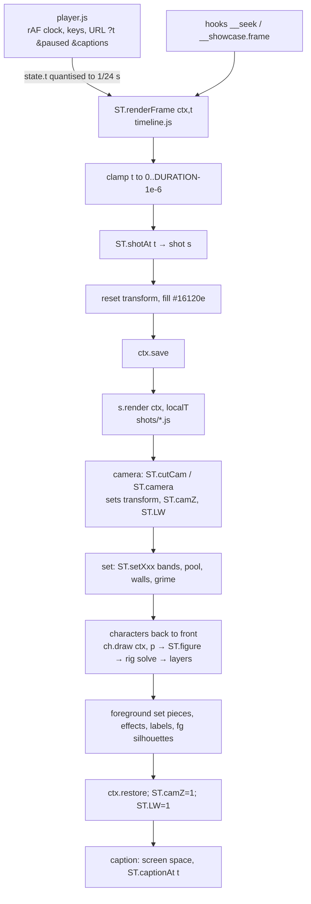

# 02 · Architecture — how the C-CAM engine produces a frame

Scope: the code in `films/<film>/js/` of the three films. Paths starting `films/` are relative to the C-CAM folder.
Related: [03-API_REFERENCE](03-API_REFERENCE.md), [05-CAMERA_GUIDE](05-CAMERA_GUIDE.md), [06-FILM_AUTHORING](06-FILM_AUTHORING.md).

## 1. Shape of the system

- **Classic scripts, no modules, no build.** Each file is an IIFE that reads/writes one global namespace object
  `window.ST`, created by `core.js` (`films/03-apollo-11/js/core.js:5`). `file://` works because nothing is imported.
- **Canvas 2D only**, 1920 × 1080 (`core.js:6-7`; `<canvas id="frame" width="1920" height="1080">`,
  `films/03-apollo-11/showcase.html:23`). No WebGL, no images, no fonts loaded, no network.
- **Frame = f(t).** `ST.renderFrame(ctx, t)` repaints the whole frame from nothing for a film time `t`
  (`films/03-apollo-11/js/timeline.js:40-53`). The only wall clock is `requestAnimationFrame` in `player.js`
  (`films/03-apollo-11/js/player.js:1-2,38-49`).

### Engine vs film code

The "engine" files are byte-identical copies across the three films (MD5 checked 2026-10-09: `core.js`, `face.js`,
`grime.js`, `rig.js`, `poses.js`, `timeline.js`, `player.js`, `test-page.js`, `tools/shoot.mjs`), with two exceptions:
- `brushes.js`: film 1 names the camera's 5th parameter `tilt`, films 2–3 `rot`; same behaviour
  (`films/01-samurai-edo/js/brushes.js:10-14` vs `films/03-apollo-11/js/brushes.js:10-14`).
- `camera.js`: **three different files** with three different APIs (one per film), see [05-CAMERA_GUIDE §2](05-CAMERA_GUIDE.md#2-the-three-cut-table-dialects).

`tools/proof.mjs` also differs (sheet tile size in film 1, per-cut sampling in film 2).

| File | Kind | Responsibility |
|---|---|---|
| `core.js` | engine | frame size, fps, shot/cast registries, seeded hash/noise, easing, keyframes (`key`, `step`), twos, talk, blink, palette `ST.C` |
| `brushes.js` | engine | camera, figure space, Catmull-Rom curve, ink line, blob (fill + crescents + mottle + hatch + ink), tube, rough architecture, bands, stars, pool, gloom, bricks, label |
| `face.js` | engine | expression table, face state, eye, brow, mouth, stubble, wart, pores, mitten hand |
| `grime.js` | engine | stain, peel, crack, cobbles, half-timbered house, window, puddle, flies |
| `rig.js` | engine | views, view ring turns, projection, 2-bone IK, limb rigs, palm, arm/leg/foot drawing, pose solve + face guard, arm layering, head view |
| `poses.js` | engine | body-space pose library scaled by each character's dimensions |
| `camera.js` | camera (per film) | cuts inside a shot, foreground silhouettes |
| `props.js` / `acting.js` | topic | film 1: bow, world↔figure, palm solve, swords, Edo props; film 2: seated/ballot/point/shake + ballot slip; film 3: helmet, thumbs-up, held props, `reachTo` |
| `edo.js` / `lunar.js` | topic | set brushes of the topic (roofs, shoji… / craters, lander, gauges, DSKY…) |
| `cast/*.js` | topic | one hand-built character per file + `crowd.js` (background figures); film 1 also `cat.js` |
| `sets/sets-*.js` | topic | one function per setting (`ST.setOffice`, `ST.setHall`, `ST.setLM`, …) |
| `shots/shots-*.js` | topic | `ST.defineShot(id, { title, role, note, cuts?, render(ctx, t) })` |
| `film.js` | topic | `ST.FILM` = the cut: order, durations, caption lines |
| `timeline.js` | engine | lays `ST.FILM` end to end, `ST.renderFrame`, captions |
| `player.js` | engine (chrome) | the only wall clock: playback, keys, scrubber, URL params, hooks |
| `test-page.js` | engine (dev) | turnaround sheets for `test.html` |

## 2. Load order

`films/03-apollo-11/showcase.html:35-58` (film 1 loads `camera.js` right after `brushes.js` and adds `shots-d.js`;
film 2 has `acting.js` + `camera.js` after `poses.js`, no `props.js`):

```
core → brushes → face → grime → rig → poses → camera → props → lunar/edo
     → cast/* → crowd → sets/sets-a..c → shots/shots-a..d → film → timeline → player
```

Order constraints that the code relies on:
- `core.js` creates `ST` (`core.js:5`); every later file reads `window.ST`.
- Brushes capture `ST.C` at load (`const ST = window.ST, C = ST.C`, `brushes.js:5`), so `core.js` must precede.
- Cast files call `ST.pose`/`ST.handAt` only inside functions, but `test.html` must load `props.js` before cast files
  that use topic props (`films/03-apollo-11/test.html:24-29`). `test.html` does not load `camera.js`.
- `film.js` must come after all shots (it only declares a table) and **`timeline.js` must come after `film.js`**: it
  maps `ST.FILM` at load and throws if a shot id is missing (`timeline.js:7-13`; the error text still says
  "dancing plague", a leftover).
- `player.js` last: it reads `ST.SHOTS`/`ST.DURATION` at load (`player.js:5`).

## 3. Diagram



## 4. Time model

| Clock | Definition | Used for |
|---|---|---|
| Wall clock | `requestAnimationFrame(now)`; `state.t += min(0.1, dt)` (`player.js:38-49`) | playback only |
| Film clock `t` | seconds from the film start; the player quantises it to 1/24 s before drawing: `floor(t·24 + 1e-6)/24` (`player.js:15,18`) | `ST.renderFrame` |
| Shot clock (local `t`) | `round((t − s.t0)·1e6)/1e6` (`timeline.js:19`) | everything inside a shot |
| Acting clock `tt` | `ST.twos(t) = floor(t·12 + 1e-6)/12` (`core.js:52`) — 12 poses per second | poses, positions, turns, head jolts, cut selection (films 1–2) |

- Shot boundaries: `ST.FILM[i].dur` values are summed and rounded to milliseconds (`timeline.js:6-14`); hard cuts.
- `ST.shotAt(t)` = the last shot whose `t0 ≤ t` (`timeline.js:15-18`). `renderFrame` clamps `t` to
  `[0, DURATION − 1e-6]` (`timeline.js:41`).
- Within a shot authors mix two conventions on purpose: the **camera** reads raw `t` (smooth 24 fps moves); **acting**
  reads `tt` (twos). Expression changes use `ST.step(t, …)` on raw `t` (`face` snaps, e.g.
  `films/01-samurai-edo/js/shots/shots-d.js:75`), so an expression may switch on an odd 24 fps frame.
- Blinks and jaw flaps quantise internally to twos (`core.js:76,87`).
- Cut selection: film 1 picks the current framing on twos (`films/01-samurai-edo/js/camera.js:9-14`), film 2 likewise
  (`films/02-papal-conclave/js/camera.js:32-37`), film 3 on raw `t` (`films/03-apollo-11/js/camera.js:10-11`).

## 5. Seeded randomness

There is **no PRNG state** anywhere. All variation comes from a pure integer hash:
- `ST.hash(a, b, c, d)` → [0, 1): four integer inputs mixed by a murmur-style finaliser (`core.js:17-32`). Inputs are
  truncated with `| 0`, so fractional arguments lose their fraction.
- `ST.rnd(lo, hi, a, b, c, d)` = scaled hash (`core.js:33`); `ST.noise1(seed, x)` = smooth value noise (`core.js:35-38`).
- Every drawing call carries a literal **seed** (`seed: SEED + n` per character, `SEED` constants 110…1100 in the cast
  files); wobble, mottling, hatch angles, teeth jitter are functions of that seed only.
- Time-varying "randomness" hashes the frame index, e.g. flies use `floor(twos(t)·12)` (`grime.js:95`), the candle
  flame `ST.hash(9, floor(ST.twos(t)·12))` (`films/02-papal-conclave/js/sets/sets-b.js:104`).

Rules for new code: never `Math.random`, `Date`, `performance.now`, timers or `requestAnimationFrame` in anything but
the player; derive every value from `t` and literal seeds; never keep state between frames.

## 6. Determinism

Measured 2026-10-09 (headless Chrome via playwright-core, `ST.renderFrame` into a fresh 1920×1080 canvas, times
2.5, 12.3, 31.25, 45.6, 60.1 s; each frame rendered, then other times, then the same time again, and on a fresh canvas):

| Canvas | Film 1 | Film 2 | Film 3 |
|---|---|---|---|
| CPU-backed (`getContext('2d', { willReadFrequently: true })`) | bit-identical **except the daydream shot (10–16 s)**: the first render on a canvas differs from re-renders on ~1 M pixel channels by ≤ 12/255 | bit-identical | bit-identical |
| Default (GPU-accelerated) | ≤ 3 channels differ | 15–33 channels differ by ≤ 20/255 at most times | 12–45 channels differ by ≤ 20/255 |

Conclusions:
1. The code itself is deterministic; **use a CPU-backed canvas** when frames must be reproducible (export, goldens).
   The showcase player uses the default context (`player.js:7`), so its PNGs can differ by a few pixels between runs.
2. Film 1's `ST.silhouette` draws the dream fighters into a module-level scratch canvas created with
   `document.createElement` and composites it (`films/01-samurai-edo/js/sets/sets-a.js:68-86`). Re-rendering a dream
   frame on the same target canvas gives slightly different pixels than the first render (second and third renders
   are equal). Root cause not isolated beyond that observation (**UNKNOWN**: Chromium canvas-to-canvas `drawImage` path
   vs. state). Do not use scratch canvases; draw silhouettes with a flat-fill override instead
   ([08](08-KNOWN_ISSUES_AND_BACKLOG.md)).

## 7. Global mutable state (what a port must remove)

| State | Where | Effect |
|---|---|---|
| `ST.LW` (ink width multiplier) | set by `ST.camera` (`brushes.js:18`), `ST.figure` (`:27`, restored `:30`), `ST.fg`/`ST.fgArm` (`films/02-papal-conclave/js/camera.js:12-14,23-27`), reset in `renderFrame` (`timeline.js:50`) and the test page (`test-page.js:42`) | every brush reads it; a brush called outside a figure uses the camera's value |
| `ST.camZ` | `ST.camera` (`brushes.js:17`), reset `timeline.js:49` | used by `ST.figure` to compute `LW` |
| `ST.showCaptions` | `timeline.js:25`, written by the player (`player.js:17`) | captions on/off |
| `scratch` canvas | `films/01-samurai-edo/js/sets/sets-a.js:69-71` | see §6 |
| Registries `ST.SHOT_DEFS`, `ST.CAST`, `ST.FILM`, `ST.SHOTS` | `core.js:12-15`, `film.js`, `timeline.js:7` | written once at load |

The canvas context's own state is protected by `ctx.save()/restore()` around each shot (`timeline.js:46-48`);
characters and props use their own save/restore pairs.

## 8. How one frame is produced (draw order)

1. `renderFrame` clamps `t`, picks the shot, resets the transform, fills the frame with `#16120e`
   (`timeline.js:41-45`).
2. The shot's `render(ctx, localT)` runs inside `save/restore` (`timeline.js:46-48`). By convention (all 36 shots):
   1. **Camera first** — `ST.cutCam(...)` or `ST.camera(...)`; contact points that the camera frames are solved
      *before* it in world space (`films/01-samurai-edo/js/shots/shots-c.js:92-100`).
   2. **Set** — `ST.setXxx(ctx, t, o)`: sky bands, pool, walls, grime, floor.
   3. **Mid props** that stand behind people (bale on the ground, ladder, price board).
   4. **Background people** (`ST.crowdFigure`), then **cast** back to front, each via `ch.draw(ctx, p)`.
   5. **Foreground set pieces** (table front with items, console front, quilt) and effects (sparks, rain, CLACK).
   6. **Foreground silhouettes** last (`ST.fg`, `ST.fgShape`, giant crowd backs).
3. After the shot `ST.camZ = 1; ST.LW = 1` (`timeline.js:49-50`).
4. Captions in screen space, if on (`timeline.js:51-52`).

Inside one character (`draw(ctx, p)`, e.g. `films/03-apollo-11/js/cast/commander.js:114-145`):
view → pose → `ST.solve` → face state → `ST.figure` transform → layer-0 arms (behind) → legs (far first, sorted by
depth) → bob translate → neck + torso + collar → layer-1 arms (raised, behind the head) → head (own view, may be
mirrored, scaled 1.05–1.2) + headwear → props under hands (`beforeHand`) → layer-2 arms (near) → `after(J)` hook.

## 9. Player and test page

- Player (`player.js`): builds shot buttons from `ST.SHOTS` (`:27-32`), fits the canvas to the window (`:33-37`), keys
  (`:58-73`), scrubber (`:56`), loop and captions checkboxes, the note line shows `title (role) · note` of the current
  shot (`:23`). Hooks `__duration`, `__seek`, `__showcase` (`:79-85`).
- Test page (`test-page.js`): one sheet per `ST.CAST` entry: 6 yaws (front, 3/4 R, profile R, back, profile L, 3/4 L)
  × rows `stand`, `akimbo`, `jig`, `flail`, `point R` (+ the character's `extraRow`) + a faces row of 6 expressions
  (deadpan, miserable, shock, smug, rage, exhausted) at yaws 0, 1, 2, 1, 0, −1 (`test-page.js:7-17`). Characters are
  drawn at `t = 0.05` with `ch.demo` props (`:48`).

## 10. Performance

`ST.renderFrame` at 1920 × 1080 (40 evenly spaced frames per film, default canvas, Papi's machine, 2026-10-09):
median 4.0 / 3.3 / 5.6 ms, 90th percentile 8.7 / 14.2 / 7.5 ms, worst 81 / 44 / 118 ms (films 1 / 2 / 3; the worst
frames are single outliers, cause **UNKNOWN**, probably first-use warm-up). Reading the pixels back
(`getImageData`/`toDataURL`) is extra and not included. Cost drivers visible in the code: Catmull-Rom subdivision every
7 px (`brushes.js:34-54`), the ink ribbon per outline, per-blob `save/clip/restore` for crescents/mottle/hatch
(`brushes.js:166-183`), many small blobs in sets (`films/03-apollo-11/js/lunar.js:32-37`: 14 craters + 60 pebbles).
