# Kit catalog

Generated by `pnpm kit:catalog` from `kitCatalog()` (kit 0.2.0); do not edit by hand.
Scenes call `ctx.kit.<namespace>.<name>(params)` in `build()`; every result is a kit object
(`.on(surface)`, `.mount(child, anchor)`, `.anchor(name)`). Animated objects have `update(t)`:
call it from the scene's `update(t)` on every frame, like every other hook (pure functions of t).
Props a video needs that the kit lacks are built per project as `kit-ext/props/<name>.js`
(project-local, ADR-007); they are not listed here: `reelforge kit-docs` shows them.

## Props

### `kit.props.calculator(params)`

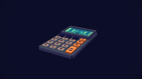

Desk calculator (~0.8 x 1.4 units, lies flat) with a raised LCD and a 4x5 keypad. The LCD shows text, a tiny animated shooter (doom), static or a glitch: calc.screen.setMode/setText/glitch(amount)/power(on); call calc.update(t) every frame for animated modes.

| Param | Type | Default | Description |
| --- | --- | --- | --- |
| `screen` | "blank" \| "text" \| "doom" \| "glitch" | `"text"` | LCD content: blank, text (right-aligned), doom (tiny animated shooter), glitch |
| `text` | string | `"0"` | LCD text in text/glitch modes, e.g. "61 KB" (A-Z 0-9 . , : - + = % $ / ! ?) |
| `body` | string |  | Palette name of the body (default: style-aware) |
| `keys` | string |  | Palette name of the number keys (default: style-aware) |
| `operators` | string | `"hero"` | Palette name of the operator keys column |
| `seed` | integer | `0` | Layout variant (same seed = same look in every shot) |
| `scale` | number | `1` | Uniform size multiplier (1 = catalog size) |

Anchors (besides center, top, bottom, front, back, left, right):

- `screen`: centre of the LCD surface (faces up)
- `keypad`: centre of the keypad, on the keys

Methods:

- `screen.setMode(mode)`: LCD mode: 'blank' | 'text' | 'doom' | 'glitch'
- `screen.setText(text)`: LCD text (right-aligned, auto-sized)
- `screen.glitch(amount)`: glitch overlay 0..1 on any mode; set every frame
- `screen.power(on)`: LCD on/off (true/false or 0..1)
- `update(t)`: animates doom/glitch; call every frame

### `kit.props.bench(params)`

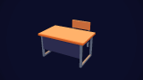

School/exam desk (~1.6 x 1 units, top 0.875 high) on a steel frame with a book shelf and a front panel, plus an optional chair behind it. Put props on it with prop.on(bench) or at spotLeft/spotRight. Static.

| Param | Type | Default | Description |
| --- | --- | --- | --- |
| `chair` | boolean | `true` | Chair behind the desk (a student would face the camera) |
| `wood` | string |  | Palette name of the desk top and seat (default: style-aware) |
| `frame` | string |  | Palette name of the steel frame (default: style-aware) |
| `scale` | number | `1` | Uniform size multiplier (1 = catalog size) |

Anchors (besides center, top, bottom, front, back, left, right):

- `top`: centre of the desk top (so prop.on(bench) stands on the desk, not the chair back)
- `spotLeft`: on the desk top, left
- `spotRight`: on the desk top, right
- `seat`: top of the chair seat (when chair is true)

### `kit.props.paper(params)`

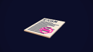

A sheet of paper (~0.75 x 1.05 units, 1 voxel thin, lies flat): blank, ruled lines, text lines with an optional pixel-letter title, or text with a red stamp. For exams, contracts, leaked memos. Static.

| Param | Type | Default | Description |
| --- | --- | --- | --- |
| `variant` | "blank" \| "lines" \| "text" \| "stamp" | `"text"` | blank, lines (ruled), text (title + text lines), stamp (text + red stamp) |
| `title` | string | `""` | Title in pixel letters (~5 characters fit; empty = a title bar) |
| `color` | string |  | Palette name of the paper (default: style-aware) |
| `seed` | integer | `0` | Layout variant (same seed = same look in every shot) |
| `scale` | number | `1` | Uniform size multiplier (1 = catalog size) |

Anchors (besides center, top, bottom, front, back, left, right):

- `title`: title line on the sheet
- `stamp`: centre of the stamp area

### `kit.props.laptop(params)`

Laptop (~1.25 units wide) with a hinged lid and a pixel screen (code, chart, text, doom, glitch). laptop.open(amount) swings the lid (0 closed, 1 open); laptop.screen controls the display.

| Param | Type | Default | Description |
| --- | --- | --- | --- |
| `screen` | "blank" \| "text" \| "doom" \| "glitch" \| "code" \| "chart" | `"code"` | Screen content: blank, text, doom, glitch, code (scrolling), chart (live bars) |
| `text` | string | `"HELLO"` | Text of the text/glitch modes ('\n' = new line) |
| `seed` | integer | `0` | Layout variant (same seed = same look in every shot) |
| `scale` | number | `1` | Uniform size multiplier (1 = catalog size) |
| `open` | number (0..1) | `1` | Lid: 0 closed .. 1 open (animate with laptop.open) |
| `shell` | string |  | Palette name of the case (default: style-aware) |

Anchors (besides center, top, bottom, front, back, left, right):

- `screen`: centre of the screen (faces +z when open)
- `keyboard`: centre of the keyboard

Methods:

- `open(amount)`: lid 0 (closed) .. 1 (open); set every frame when animating
- `screen.setMode(mode)`: 'blank' | 'text' | 'doom' | 'glitch' | 'code' | 'chart'
- `screen.setText(text)`: screen text (centred, auto-sized)
- `screen.glitch(amount)`: glitch overlay 0..1; set every frame
- `screen.power(on)`: screen on/off (true/false or 0..1)
- `update(t)`: animates code/chart/doom/glitch; call every frame

### `kit.props.monitor(params)`

Desktop monitor on a stand (~1.5 units wide, 1.35 tall) with a pixel screen: code, chart, text, doom, glitch or blank. Control it through monitor.screen; call monitor.update(t) every frame.

| Param | Type | Default | Description |
| --- | --- | --- | --- |
| `screen` | "blank" \| "text" \| "doom" \| "glitch" \| "code" \| "chart" | `"code"` | Screen content: blank, text, doom, glitch, code (scrolling), chart (live bars) |
| `text` | string | `"HELLO"` | Text of the text/glitch modes ('\n' = new line) |
| `seed` | integer | `0` | Layout variant (same seed = same look in every shot) |
| `scale` | number | `1` | Uniform size multiplier (1 = catalog size) |
| `shell` | string |  | Palette name of the case and stand (default: style-aware) |

Anchors (besides center, top, bottom, front, back, left, right):

- `screen`: centre of the screen (faces +z)

Methods:

- `screen.setMode(mode)`: 'blank' | 'text' | 'doom' | 'glitch' | 'code' | 'chart'
- `screen.setText(text)`: screen text (centred, auto-sized)
- `screen.glitch(amount)`: glitch overlay 0..1; set every frame
- `screen.power(on)`: screen on/off (true/false or 0..1)
- `update(t)`: animates code/chart/doom/glitch; call every frame

### `kit.props.server(params)`

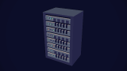

Server rack (~1.4 units wide, 2.25 tall with 8 units: taller than the hero) of 1U servers and disk shelves with blinking LEDs. Call server.update(t) (= blink(t)) every frame; server.alarm(amount) makes every LED flash the alert colour.

| Param | Type | Default | Description |
| --- | --- | --- | --- |
| `units` | integer (2..12) | `8` | Number of rack units (each 0.25 units tall) |
| `blinkRate` | number (0..20) | `2` | Average LED blinks per second |
| `frame` | string |  | Palette name of the rack frame (default: style-aware) |
| `seed` | integer | `0` | Layout variant (same seed = same look in every shot) |
| `scale` | number | `1` | Uniform size multiplier (1 = catalog size) |

Anchors (besides center, top, bottom, front, back, left, right):

- `face`: centre of the front panel

Methods:

- `blink(t)`: poses the LEDs for time t (seeded rhythm); update(t) calls it
- `alarm(amount)`: amount >= 0.5: every LED flashes the alert colour in sync; set every frame

### `kit.props.phone(params)`

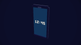

Smartphone (~0.45 x 0.95 units), standing or lying flat, with a pixel screen (lock-screen clock text by default). phone.screenOn(on) wakes/darkens it; phone.screen controls the content.

| Param | Type | Default | Description |
| --- | --- | --- | --- |
| `pose` | "standing" \| "flat" | `"standing"` | standing (screen faces +z) or flat on a surface (screen up) |
| `screen` | "blank" \| "text" \| "doom" \| "glitch" \| "code" \| "chart" | `"text"` | Screen content: text (lock-screen clock), blank, doom, glitch, code, chart |
| `text` | string | `"12:45"` | Text of the text/glitch modes |
| `on` | boolean | `true` | Screen initially on |
| `shell` | string |  | Palette name of the case (default: style-aware) |
| `seed` | integer | `0` | Layout variant (same seed = same look in every shot) |
| `scale` | number | `1` | Uniform size multiplier (1 = catalog size) |

Anchors (besides center, top, bottom, front, back, left, right):

- `screen`: centre of the screen surface

Methods:

- `screenOn(on)`: screen on/off (true/false or 0..1); set every frame when animating
- `screen.setMode(mode)`: 'blank' | 'text' | 'doom' | 'glitch' | 'code' | 'chart'
- `screen.setText(text)`: screen text (centred)
- `screen.glitch(amount)`: glitch overlay 0..1
- `update(t)`: animates the screen; call every frame

### `kit.props.folder(params)`

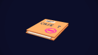

Manila case folder (~0.95 x 1.25 units, lies flat) with a tab, a label, papers peeking out and an optional title/stamp. folder.open(amount) swings the cover open to the left, showing the top document.

| Param | Type | Default | Description |
| --- | --- | --- | --- |
| `open` | number (0..1) | `0` | Cover: 0 closed .. 1 fully open (animate with folder.open) |
| `papers` | boolean | `true` | Papers inside (peeking out at the front) |
| `title` | string | `""` | Title on the cover in pixel letters (~6 characters fit) |
| `stamp` | boolean | `false` | Red stamp on the cover ("classified") |
| `color` | string |  | Palette name of the folder (default: manila) (default: style-aware) |
| `seed` | integer | `0` | Layout variant (same seed = same look in every shot) |
| `scale` | number | `1` | Uniform size multiplier (1 = catalog size) |

Anchors (besides center, top, bottom, front, back, left, right):

- `cover`: centre of the closed cover
- `document`: centre of the top document inside

Methods:

- `open(amount)`: cover 0 (closed) .. 1 (open); set every frame when animating

### `kit.props.documentStack(params)`

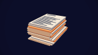

A stack of paper sheets (~0.8 x 1.1 units, height = count voxels) with a few manila dividers; the top sheet carries text lines/title/stamp. For bureaucracy, evidence, "thousands of pages". Static.

| Param | Type | Default | Description |
| --- | --- | --- | --- |
| `count` | integer (2..60) | `12` | Number of sheets (1 voxel each) |
| `messy` | integer (0..3) | `1` | Max sideways offset of a sheet in voxels |
| `variant` | "blank" \| "lines" \| "text" \| "stamp" | `"text"` | blank, lines (ruled), text (title + text lines), stamp (text + red stamp) |
| `title` | string | `""` | Title in pixel letters (~5 characters fit; empty = a title bar) |
| `seed` | integer | `0` | Layout variant (same seed = same look in every shot) |
| `scale` | number | `1` | Uniform size multiplier (1 = catalog size) |

Anchors (besides center, top, bottom, front, back, left, right):

- `title`: title line of the top sheet

### `kit.props.cash(params)`

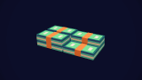

Money: banded bill bricks stacked in a pile (~1.3 x 0.7 units footprint) or stacks of coins. For salaries, bribes, profit, "millions". Static.

| Param | Type | Default | Description |
| --- | --- | --- | --- |
| `kind` | "bills" \| "coins" | `"bills"` | bills: banded bill bricks; coins: stacks of coins |
| `count` | integer (1..24) | `6` | Number of bill bricks (stacked 4 per layer) or coin stacks |
| `seed` | integer | `0` | Layout variant (same seed = same look in every shot) |
| `scale` | number | `1` | Uniform size multiplier (1 = catalog size) |

### `kit.props.suitcase(params)`

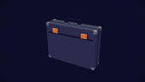

Case standing upright: a briefcase (~1.2 x 1 units, latches, handle on top) or a trolley suitcase (~0.95 x 1.5 units, ribbed shell, wheels, telescopic handle). For travel, deals, "the money case". Static.

| Param | Type | Default | Description |
| --- | --- | --- | --- |
| `style` | "briefcase" \| "trolley" | `"briefcase"` | briefcase (handle on top) or trolley (wheels, telescopic handle) |
| `color` | string |  | Palette name of the case (default: dark for briefcase, accent1 for trolley) (default: style-aware) |
| `scale` | number | `1` | Uniform size multiplier (1 = catalog size) |

Anchors (besides center, top, bottom, front, back, left, right):

- `handle`: top of the handle

### `kit.props.lock(params)`

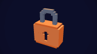

Padlock (~0.5 units wide, 0.75 tall) with a brass body, keyhole and steel shackle. lock.unlock(amount): 0..0.5 lifts the shackle, 0.5..1 swings it open. For security, privacy, "locked out", hacks.

| Param | Type | Default | Description |
| --- | --- | --- | --- |
| `open` | number (0..1) | `0` | 0 locked .. 1 open (animate with lock.unlock) |
| `body` | string |  | Palette name of the body (default: brass) (default: style-aware) |
| `scale` | number | `1` | Uniform size multiplier (1 = catalog size) |

Anchors (besides center, top, bottom, front, back, left, right):

- `keyhole`: the keyhole on the front

Methods:

- `unlock(amount)`: 0 locked .. 1 open (lift, then swing); set every frame when animating

### `kit.props.key(params)`

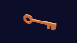

A key (~0.95 units long): classic brass key with a ring bow and bits, or a modern key with a plastic head. Upright facing the camera or lying flat. For access, passwords, solutions. Static.

| Param | Type | Default | Description |
| --- | --- | --- | --- |
| `style` | "classic" \| "modern" | `"classic"` | classic (ring bow, bits) or modern (plastic head, cut blade) |
| `pose` | "upright" \| "flat" | `"upright"` | upright (faces +z, stands on its edge) or flat on a surface |
| `color` | string |  | Palette name of the metal (default: brass for classic, steel for modern) (default: style-aware) |
| `scale` | number | `1` | Uniform size multiplier (1 = catalog size) |

Anchors (besides center, top, bottom, front, back, left, right):

- `bow`: centre of the bow/head (where a hand holds it)
- `tip`: tip of the blade

### `kit.props.clock(params)`

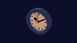

Clock with hour, minute and ticking second hands: a round wall clock (~0.9 units) or an alarm clock with twin bells. clock.setTime(h, m, s) poses the hands; clock.update(t) runs from the start time at `speed`. For deadlines, countdowns, "hours later".

| Param | Type | Default | Description |
| --- | --- | --- | --- |
| `style` | "wall" \| "alarm" | `"wall"` | wall (round, faces +z) or alarm (desk clock with bells and feet) |
| `time` | string | `"10:10"` | Time shown at t = 0, "HH:MM" or "HH:MM:SS" |
| `speed` | number (-100000..100000) | `1` | Clock seconds per scene second in update(t) (3600 = an hour per second; 0 = frozen) |
| `frame` | string |  | Palette name of the frame/body (default: style-aware) |
| `scale` | number | `1` | Uniform size multiplier (1 = catalog size) |

Anchors (besides center, top, bottom, front, back, left, right):

- `face`: centre of the dial (faces +z)

Methods:

- `setTime(hours, minutes, seconds)`: poses the hands (fractions allowed); call every frame when animating
- `update(t)`: setTime(start time + t * speed seconds)

### `kit.props.globe(params)`

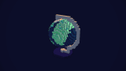

Desk globe (~1 unit tall): a voxel Earth (oceans, continents, polar ice) tilted on a meridian arc over a round base. globe.update(t) spins it at `speed`; globe.spin(angle) sets the angle. For world, travel, global reach.

| Param | Type | Default | Description |
| --- | --- | --- | --- |
| `speed` | number (-20..20) | `0.5` | Spin in radians per second in update(t) |
| `angle` | number | `0` | Spin angle at t = 0, radians |
| `tilt` | number (-45..45) | `23.4` | Axis tilt in degrees |
| `sea` | string |  | Palette name of the oceans (default: style-aware) |
| `land` | string |  | Palette name of the continents (default: style-aware) |
| `stand` | string |  | Palette name of the arc and base (default: style-aware) |
| `scale` | number | `1` | Uniform size multiplier (1 = catalog size) |

Anchors (besides center, top, bottom, front, back, left, right):

- `ball`: centre of the ball

Methods:

- `spin(angle)`: sets the spin angle in radians (about the tilted axis)
- `update(t)`: spin(angle + speed * t)

### `kit.props.mapTable(params)`

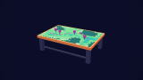

Planning table (~3 x 2 units, 0.9 tall) with a seeded voxel map on top (sea, coast, land, hills, a dashed route) and push pins. mapTable.dropPins(amount) drops the pins in one by one (0 none .. 1 all). For war rooms, heists, logistics, "where it happened".

| Param | Type | Default | Description |
| --- | --- | --- | --- |
| `pins` | [number, number][] |  | Pin positions [u, v] on the map (0..1 left->right, back->front); default: 4 seeded pins on land |
| `pinColor` | string |  | Palette name of the pin heads (default: red) |
| `wood` | string |  | Palette name of the table (default: style-aware) |
| `seed` | integer | `0` | Layout variant (same seed = same look in every shot) |
| `scale` | number | `1` | Uniform size multiplier (1 = catalog size) |

Anchors (besides center, top, bottom, front, back, left, right):

- `map`: centre of the map surface
- `pin0..pinN`: head of each pin (in pins order)

Methods:

- `dropPins(amount)`: 0 (no pins) .. 1 (all pins in place), staggered; set every frame

### `kit.props.usbStick(params)`

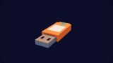

USB flash drive (~0.25 x 0.75 units, lies flat, connector towards +z) with a key loop, a label and a status LED. For data theft/leak and "the files" beats. Static.

| Param | Type | Default | Description |
| --- | --- | --- | --- |
| `body` | string | `"hero"` | Palette name of the plastic body |
| `scale` | number | `1` | Uniform size multiplier (1 = catalog size) |

Anchors (besides center, top, bottom, front, back, left, right):

- `connector`: tip of the connector
- `label`: centre of the label

### `kit.props.character(params)`

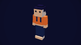

Articulated voxel person, 2 units tall, facing +z: the hero in the orange hoodie or an NPC (hoodie, suit, hacker, officer) with hair, hats and accessories. Pure poses: pose(name, t) for stand/walk/sit/point/wave/typing/think/shrug/cheer, walk(t, speed), point(target), animate({ clip, from })(t), blend/mix; hold(prop) puts a prop in a hand. Sit on a kit chair with character.on(bench, { at: "seat", align: "seat" }).

| Param | Type | Default | Description |
| --- | --- | --- | --- |
| `variant` | "hero" \| "hoodie" \| "suit" \| "hacker" \| "officer" | `"hero"` | Outfit: hero (orange hoodie), hoodie (teal), suit (tie), hacker (dark hood up), officer (uniform, peaked cap) |
| `pose` | "stand" \| "walk" \| "sit" \| "point" \| "wave" \| "typing" \| "think" \| "shrug" \| "cheer" | `"stand"` | Clip that update(t) plays (stand = idle breathing; walk = walking in place) |
| `hair` | "short" \| "long" \| "spiky" \| "bun" \| "bald" |  | Hair style (default: per variant) |
| `hat` | "none" \| "cap" \| "beanie" \| "officer" \| "hood" |  | Headwear; hood = hood up (default: per variant) |
| `skin` | "pale" \| "warm" | `"pale"` | Skin tone |
| `accessories` | "backpack" \| "headphones" \| "glasses"[] | `[]` | Any of backpack, headphones, glasses |
| `outfit` | string |  | Palette name of the main garment (hoodie, jacket, uniform) (default: style-aware) |
| `hairColor` | string |  | Palette name of the hair (default: style-aware) |
| `scale` | number | `1` | Uniform size multiplier (1 = catalog size) |

Anchors (besides center, top, bottom, front, back, left, right):

- `bottom`: between the feet (fixed, whatever the pose)
- `seat`: where the hips touch a seat in the sit/typing poses (align it with a bench "seat")
- `head`: top of the head (follows the pose)
- `face`: front of the face (follows the pose)
- `handL`: left hand (follows the pose)
- `handR`: right hand (follows the pose)

Methods:

- `update(t)`: plays the `pose` param clip at t (call every frame)
- `pose(name, t)`: applies clip `name` at local time t (stand, walk, sit, point, ...)
- `poseAt(name, t)`: the pose record of a clip, for blend/mix
- `blend(a, b, k, t)`: pose between a and b (clip names or poseAt records), k 0..1
- `mix(lower, upper, t)`: legs/hips of `lower`, torso/arms/head of `upper`, e.g. mix("sit", "wave", t)
- `animate({ clip, from, speed, fadeIn, target })`: returns (t) => void playing `clip` from scene time `from` (speed = playback rate; fadeIn s from stand; target for point)
- `walk(t, speed)`: walking gait at speed units/s (default 1.2; > 3 runs); returns the distance t * speed to move it by
- `point(target, amount, t)`: aims the right arm at a kit object or world [x, y, z]; amount 0..1 raises the arm
- `hold(object, hand, align)`: parents a prop to the 'right'/'left' hand (its `align` anchor, default 'top', at the palm)

### `kit.props.crowd(params)`

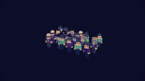

Crowd of voxel people (up to 400, cheap: one instanced batch per outfit and body part) in an area: idle people glancing around, sideways walking lanes, optional cheering. Seeded layout and outfits; call crowd.update(t) every frame. Put the hero (kit.props.character) in front.

| Param | Type | Default | Description |
| --- | --- | --- | --- |
| `count` | integer (1..400) | `40` | Number of people |
| `area` | [number, number] | `[10,6]` | Width (x) and depth (z) in units, centred on the crowd; ~1 unit per person |
| `seed` | integer | `0` | Layout variant (same seed = same look in every shot) |
| `spread` | number (0..1) | `0.7` | 0 = neat rows (audience, queue) .. 1 = loose placement |
| `walking` | number (0..1) | `0.25` | Share of rows that walk sideways in lanes (wrapping at the area edges) |
| `speed` | number (0..4) | `1.2` | Walking speed in units/s |
| `facing` | "camera" \| "random" \| "center" | `"camera"` | Standing people face the camera (+z), random directions or the centre |
| `cheer` | number (0..1) | `0` | Share of standing people cheering with raised arms |
| `variants` | "hero" \| "hoodie" \| "suit" \| "hacker" \| "officer"[] | `["hoodie","suit"]` | Outfits to draw from (see character.variant) |
| `looks` | integer (1..12) | `6` | Distinct outfits/hair combinations (each costs 10 draw calls) |
| `scale` | number | `1` | Uniform size multiplier (1 = catalog size) |

Methods:

- `update(t)`: poses every person for time t (walkers move along their lane)

### `kit.props.car(params)`

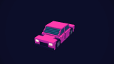

Voxel car (~4 x 1.7 units, 1.5 tall; a 2-unit person stands taller) facing +z: sedan, taxi or police with a flashing light bar. Wheels roll with car.drive(t, speed), which returns the distance to move it by. Rotate (rotation.y = Math.PI / 2) to drive across the screen.

| Param | Type | Default | Description |
| --- | --- | --- | --- |
| `style` | "sedan" \| "taxi" \| "police" | `"sedan"` | sedan, taxi (yellow, roof sign) or police (two-tone, flashing light bar) |
| `paint` | string |  | Palette name of the body (default: style-aware) |
| `speed` | number (-60..60) | `0` | Driving speed in units/s used by update(t) (wheels roll; 0 = parked) |
| `siren` | boolean | `true` | Police: the light bar flashes in update(t) |
| `scale` | number | `1` | Uniform size multiplier (1 = catalog size) |

Anchors (besides center, top, bottom, front, back, left, right):

- `top`: centre of the roof
- `cargo`: top of the trunk lid
- `hood`: top of the hood

Methods:

- `drive(t, speed)`: rolls the wheels for t seconds at speed units/s and returns the distance t * speed (move the vehicle by it along +z)
- `roll(distance)`: wheel angle for an absolute distance driven
- `update(t)`: drive(t, speed param); police lights flash

### `kit.props.van(params)`

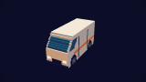

Boxy delivery van (~4.2 x 1.7 units, 2 tall) facing +z with a side stripe, rear doors and rolling wheels (van.drive(t, speed)). For couriers, stake-outs, "the van outside".

| Param | Type | Default | Description |
| --- | --- | --- | --- |
| `paint` | string |  | Palette name of the body (default: style-aware) |
| `stripe` | string |  | Palette name of the side stripe (default: style-aware) |
| `speed` | number (-60..60) | `0` | Driving speed in units/s used by update(t) (wheels roll; 0 = parked) |
| `scale` | number | `1` | Uniform size multiplier (1 = catalog size) |

Anchors (besides center, top, bottom, front, back, left, right):

- `top`: centre of the roof
- `cargo`: centre of the roof (roof rack)

Methods:

- `drive(t, speed)`: rolls the wheels for t seconds at speed units/s and returns the distance t * speed (move the vehicle by it along +z)
- `roll(distance)`: wheel angle for an absolute distance driven
- `update(t)`: drive(t, speed param)

### `kit.props.truck(params)`

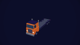

Rigid truck (~8.3 x 2 units, 3 tall) facing +z: cab with grille and exhaust stacks plus a box body, a flatbed that fits kit.props.container() (container.on(truck, { at: "cargo" })) or a tank. Three axles roll with truck.drive(t, speed).

| Param | Type | Default | Description |
| --- | --- | --- | --- |
| `body` | "box" \| "flatbed" \| "tanker" | `"box"` | box (cargo box), flatbed (fits kit.props.container on `cargo`) or tanker |
| `paint` | string |  | Palette name of the cab (default: style-aware) |
| `stripe` | string |  | Palette name of the box stripe (default: style-aware) |
| `speed` | number (-60..60) | `0` | Driving speed in units/s used by update(t) (wheels roll; 0 = parked) |
| `scale` | number | `1` | Uniform size multiplier (1 = catalog size) |

Anchors (besides center, top, bottom, front, back, left, right):

- `top`: centre of the cab roof
- `cargo`: centre of the load: flatbed deck, box roof or tank top

Methods:

- `drive(t, speed)`: rolls the wheels for t seconds at speed units/s and returns the distance t * speed (move the vehicle by it along +z)
- `roll(distance)`: wheel angle for an absolute distance driven
- `update(t)`: drive(t, speed param)

### `kit.props.container(params)`

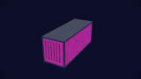

Corrugated shipping container (5.5 x 2 units, 2.25 tall), doors at the back (-z). Fits a truck flatbed: kit.props.container().on(truck, { at: "cargo" }); stack them with on(other). Colour by `seed` or `color`. Static.

| Param | Type | Default | Description |
| --- | --- | --- | --- |
| `color` | string |  | Palette name of the container (default: picked by seed) (default: style-aware) |
| `seed` | integer | `0` | Layout variant (same seed = same look in every shot) |
| `scale` | number | `1` | Uniform size multiplier (1 = catalog size) |

Anchors (besides center, top, bottom, front, back, left, right):

- `doors`: centre of the door end (faces -z)

### `kit.props.warehouse(params)`

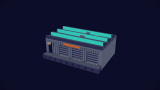

Warehouse (default 14 x 9 units, 4.5 tall) with corrugated walls, roller doors and a loading dock on the front (+z), lit office windows and a sawtooth (skylights) or flat roof with seeded roof units. For logistics, smuggling, "the depot". Static.

| Param | Type | Default | Description |
| --- | --- | --- | --- |
| `width` | number (4..40) | `14` | Width (x) in units |
| `depth` | number (4..40) | `9` | Depth (z) in units |
| `height` | number (2.5..12) | `4.5` | Wall height in units |
| `doors` | integer (0..8) | `3` | Roller doors on the front (+z) |
| `dock` | boolean | `true` | Raised loading dock in front of the doors |
| `roof` | "flat" \| "sawtooth" | `"sawtooth"` | flat or sawtooth with skylights |
| `wall` | string |  | Palette name of the corrugated walls (default: style-aware) |
| `seed` | integer | `0` | Layout variant (same seed = same look in every shot) |
| `scale` | number | `1` | Uniform size multiplier (1 = catalog size) |

Anchors (besides center, top, bottom, front, back, left, right):

- `dock`: top of the loading dock, centre front (ground in front of the doors without a dock)
- `roof`: centre of the roof
- `door`: bottom centre of the middle roller door

### `kit.props.building(params)`

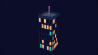

Parametric city building (default 6 storeys of 3 units, 8 x 8 units) with seeded lit windows (glow), an office lobby or apartment windows, and a rooftop: AC unit, antenna, dish, water tank or helipad. A 2-unit person is 2/3 of a storey. Static.

| Param | Type | Default | Description |
| --- | --- | --- | --- |
| `floors` | integer (1..40) | `6` | Storeys (3 units each) |
| `width` | number (2..40) | `8` | Width (x) in units (snaps to 1.5-unit bays) |
| `depth` | number (2..40) | `8` | Depth (z) in units (snaps to bays) |
| `style` | "office" \| "apartment" | `"office"` | office (glass bands, lobby) or apartment (punched windows with sills) |
| `windows` | number (0..1) | `0.45` | Share of lit windows |
| `rooftop` | "flat" \| "antenna" \| "dish" \| "tank" \| "helipad" | `"flat"` | Roof: flat (AC unit), antenna, dish, tank, helipad |
| `wall` | string |  | Palette name of the walls (default: picked by seed) (default: style-aware) |
| `seed` | integer | `0` | Layout variant (same seed = same look in every shot) |
| `scale` | number | `1` | Uniform size multiplier (1 = catalog size) |

Anchors (besides center, top, bottom, front, back, left, right):

- `roof`: centre of the roof
- `entrance`: bottom centre of the front door (+z)

### `kit.props.tower(params)`

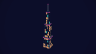

Skyscraper (default 16 storeys = 48 units, 10 units wide) with a glass curtain wall of seeded lit windows, setback tiers, a glowing crown and a spire with a beacon. Skyline backdrops, "corporate HQ". Static.

| Param | Type | Default | Description |
| --- | --- | --- | --- |
| `floors` | integer (6..60) | `16` | Storeys (3 units each) |
| `width` | number (6..30) | `10` | Base width and depth in units |
| `setbacks` | integer (0..3) | `2` | Narrower tiers towards the top |
| `windows` | number (0..1) | `0.5` | Share of lit windows |
| `spire` | boolean | `true` | Spire with a red beacon on top |
| `wall` | string |  | Palette name of the frame (default: picked by seed) (default: style-aware) |
| `seed` | integer | `0` | Layout variant (same seed = same look in every shot) |
| `scale` | number | `1` | Uniform size multiplier (1 = catalog size) |

Anchors (besides center, top, bottom, front, back, left, right):

- `roof`: centre of the top tier roof
- `spire`: tip of the spire (roof without spire)

### `kit.props.house(params)`

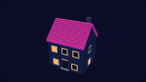

Two-storey suburban house (default 8 x 7 units, ridge ~9.5 high) with a gable roof, framed windows lit by seed, a front door with a step (+z) and a chimney. Neighbourhoods, "at home", break-ins. Static.

| Param | Type | Default | Description |
| --- | --- | --- | --- |
| `width` | number (5..16) | `8` | Width (x) in units |
| `depth` | number (5..14) | `7` | Depth (z) in units |
| `windows` | number (0..1) | `0.5` | Share of lit windows |
| `wall` | string |  | Palette name of the walls (default: picked by seed) (default: style-aware) |
| `roof` | string |  | Palette name of the roof (default: picked by seed) (default: style-aware) |
| `seed` | integer | `0` | Layout variant (same seed = same look in every shot) |
| `scale` | number | `1` | Uniform size multiplier (1 = catalog size) |

Anchors (besides center, top, bottom, front, back, left, right):

- `door`: bottom centre of the front door (+z)
- `ridge`: middle of the roof ridge

### `kit.props.drone(params)`

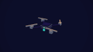

Quadcopter drone (~0.9 units across) with four rotors that spin as a function of t, a camera pod and nav lights (green front, red back); hovers gently. Surveillance, deliveries, "eyes in the sky". Call drone.update(t) every frame.

| Param | Type | Default | Description |
| --- | --- | --- | --- |
| `hover` | boolean | `true` | Gentle hover bob in update(t) |
| `body` | string |  | Palette name of the body (default: style-aware) |
| `scale` | number | `1` | Uniform size multiplier (1 = catalog size) |

Anchors (besides center, top, bottom, front, back, left, right):

- `camera`: camera lens (faces +z, below the body)

Methods:

- `update(t)`: spins the rotors and bobs (hover) for time t
- `spin(t)`: rotor angles for time t only (no bob)

## Environments

### `kit.env.sky(params)`

Backdrop sky dome with a banded, Bayer-dithered gradient in palette colours and optional twinkling stars. Draws behind everything (no depth); centred on its position, so keep the camera well inside the radius. Call sky.update(t) when it has stars.

| Param | Type | Default | Description |
| --- | --- | --- | --- |
| `style` | "dusk" \| "night" \| "dawn" \| "void" | `"dusk"` | dusk: navy->violet->magenta; night: black->navy->teal; dawn: indigo->pink->orange; void: near-black |
| `colors` | string[] |  | Palette names from the top of the sky to the horizon; overrides style |
| `stars` | integer (0..2000) | `0` | Number of 1-px stars (seeded); they twinkle with update(t) |
| `starColor` | string | `"text"` | Palette name of lit stars |
| `dither` | number (0..1) | `0.6` | Width of the dithered transition between two bands (0 = hard bands, 1 = all dither) |
| `horizon` | number (-0.5..0.5) | `0` | Elevation (sine of the angle) of the last colour; below it the sky stays that colour |
| `top` | number (0.1..1) | `0.5` | Elevation where the first colour starts (higher = taller gradient) |
| `radius` | number (10..900) | `300` | Dome radius in units (camera far is 1000) |

### `kit.env.neonGrid(params)`

Synthwave neon grid floor at y = 0 stretching to the horizon, lines fading into the horizon colour; pair it with kit.env.sky. A backdrop: draws before other objects and writes no depth, so props stand on it without outlines from the floor. Call grid.update(t) to apply scroll.

| Param | Type | Default | Description |
| --- | --- | --- | --- |
| `variant` | "violet" \| "teal" \| "navy" | `"violet"` | violet: magenta lines on indigo; teal: teal lines on navy; navy: dim teal on black |
| `scroll` | number \| function \| value | `0` | Lines moving towards +z: a speed in units per second, or a pure function (t) => offset in units. Applied by grid.update(t) |
| `horizon` | number (5..500) | `60` | Radius of the grid disc in units; lines are fully faded into the horizon colour at this distance |
| `fog` | number (0..1) | `0.6` | Share of the horizon distance (from the camera) over which lines fade out; 0 = no fade |
| `cell` | number (0.25..20) | `2` | Grid spacing in units |
| `lineWidth` | number (0.01..1) | `0.08` | Line width in units (near the camera) |
| `floorColor` | string |  | Palette name of the floor (default: by variant) |
| `lineColor` | string |  | Palette name of the lines (default: by variant) |
| `horizonColor` | string |  | Palette name the grid fades into; match it to the lowest sky colour |

Anchors (besides center, top, bottom, front, back, left, right):

- `top`: the floor at the origin (y = 0), so kit props .on(grid) stand on it

### `kit.env.lights(params)`

Default lighting rig for flat-shaded voxels (hemisphere fill + key light, optional rim), in palette colours. Add exactly one to the scene (ctx.scene.add(kit.env.lights())); lights aim at the rig's position. Static (update is a no-op).

| Param | Type | Default | Description |
| --- | --- | --- | --- |
| `preset` | "default" \| "soft" \| "dramatic" \| "neon" \| "noir" | `"default"` | default: warm key from front-right + hemisphere fill; soft: flat, low contrast; dramatic: low side key, dark fill, accent rim; neon: cool fill, magenta/accent rim for neon grids; noir: low-key (almost no fill), hard high key from the left, accent rim from behind-right |
| `intensity` | number (0..4) | `1` | Multiplier of every light of the rig |
| `azimuth` | number (-360..360) |  | Turns the rig: key light direction in degrees around +y (0 = from +z, the camera side) |

### `kit.env.desk(params)`

Voxel desk (top, apron, four legs, optional drawer block with handles). Put props on it with prop.on(desk) or at spotLeft/spotRight. Static.

| Param | Type | Default | Description |
| --- | --- | --- | --- |
| `width` | number (1..12) | `4` | Width in units (the hero is 2 tall) |
| `depth` | number (0.75..6) | `2` | Depth in units |
| `height` | number (0.5..3) | `1` | Height of the top surface in units |
| `drawers` | boolean | `true` | Drawer block under the right side |
| `wood` | string |  | Palette name of the top (default: a warm wood swatch) |
| `woodAlt` | string |  | Palette name of trims and alternate planks |
| `woodDark` | string |  | Palette name of legs and shadows |

Anchors (besides center, top, bottom, front, back, left, right):

- `spotLeft`: on the top, left quarter
- `spotRight`: on the top, right quarter (above the drawers)

### `kit.env.bench(params)`

Voxel workbench: thick planked top, four legs, a lower shelf and an optional vise. Props go on it with prop.on(bench) or at spotLeft/spotRight. Static.

| Param | Type | Default | Description |
| --- | --- | --- | --- |
| `width` | number (1.5..12) | `5` | Width in units |
| `depth` | number (0.75..4) | `1.5` | Depth in units |
| `height` | number (0.5..3) | `1.125` | Height of the top surface in units |
| `vise` | boolean | `true` | Metal vise on the front-left edge |
| `wood` | string |  | Palette name of the top (default: a warm wood swatch) |
| `woodAlt` | string |  | Palette name of trims and alternate planks |
| `woodDark` | string |  | Palette name of legs and shadows |

Anchors (besides center, top, bottom, front, back, left, right):

- `spotLeft`: on the top, left quarter
- `spotRight`: on the top, right quarter

### `kit.env.room(params)`

Open voxel room (floor, back wall with a glowing window, left wall; open to +z and +x so the camera looks in from the front-right). prop.on(room) stands props on the floor centre. Static.

| Param | Type | Default | Description |
| --- | --- | --- | --- |
| `width` | number (3..24) | `8` | Width (x) in units |
| `depth` | number (3..24) | `6` | Depth (z) in units |
| `height` | number (2..12) | `4.5` | Wall height in units |
| `wall` | string |  | Palette name of the upper walls |
| `wallAlt` | string |  | Palette name of the wainscot (lower walls) |
| `floor` | string |  | Palette name of the floor planks |
| `floorAlt` | string |  | Palette name of alternate floor planks |
| `window` | boolean | `true` | Glowing window in the back wall |
| `windowColor` | string | `"accent1"` | Palette name of the window glow |
| `rug` | boolean | `true` | Rug in the middle of the floor |

Anchors (besides center, top, bottom, front, back, left, right):

- `top`: floor centre (so prop.on(room) stands on the floor)
- `floor`: floor centre
- `backWall`: centre of the back wall, inner face (for posters/screens: mount with align "back")
- `leftWall`: centre of the left wall, inner face
- `window`: centre of the window, inner face

### `kit.env.blockCity(params)`

Seeded voxel city: street grid, towers with lit window columns and antennas, parks on empty lots; taller downtown. Use as a miniature for top-down or orbit shots (a 2-unit hero is about 2 floors tall). Static.

| Param | Type | Default | Description |
| --- | --- | --- | --- |
| `seed` | integer | `0` | Layout variant (same seed = same city) |
| `density` | number (0..1) | `0.8` | Share of lots with a building (the rest are small parks) |
| `blocks` | integer (1..10) | `5` | City blocks per side (3 units each) |
| `maxHeight` | number (1..20) | `6` | Tallest tower in units |
| `minHeight` | number (0.5..20) | `1` | Lowest building in units |
| `windows` | number (0..1) | `0.45` | Share of lit windows |

Anchors (besides center, top, bottom, front, back, left, right):

- `top`: street level at the street crossing nearest the centre
- `street`: same as top

### `kit.env.floatingCubes(params)`

Seeded cloud of small cubes (some glowing) slowly orbiting, bobbing and tumbling - the floating voxel debris of the reference style. Call cubes.update(t) every frame.

| Param | Type | Default | Description |
| --- | --- | --- | --- |
| `count` | integer (1..500) | `24` | Number of cubes |
| `seed` | integer | `0` | Layout variant (same seed = same layout) |
| `area` | [number, number, number] | `[10,5,10]` | [diameter x, height, diameter z] in units; cubes float from y = 0 up to height |
| `clear` | number | `0` | Keep-out radius around the y axis in units |
| `size` | [number, number] | `[0.15,0.5]` | [min, max] cube edge in units |
| `colors` | string[] | `["accent1","accent2","accent4","heroTrim"]` | Palette names the cubes are drawn from |
| `glow` | number (0..1) | `0.25` | Share of unlit (glowing) cubes |
| `drift` | number | `0.08` | Orbit speed around the y axis in rad/s |
| `bob` | number | `0.25` | Bobbing amplitude in units |
| `spin` | number | `0.9` | Max tumble speed in rad/s |

### `kit.env.void(params)`

Empty dark stage: near-black dithered gradient sky, seeded floating cubes and crystal shards drifting around a clear centre (the subject goes at the origin). For abstract or "nothing but the idea" shots. Call env.update(t) every frame.

| Param | Type | Default | Description |
| --- | --- | --- | --- |
| `seed` | integer | `0` | Layout variant (same seed = same layout) |
| `cubes` | integer (0..400) | `36` | Number of floating cubes |
| `shards` | integer (0..400) | `18` | Number of crystal shards |
| `area` | [number, number, number] | `[20,10,20]` | [diameter x, height, diameter z] of the debris cloud, centred on the origin |
| `clear` | number | `3` | Keep-out radius around the y axis, so debris stays off the subject |
| `stars` | integer (0..2000) | `60` | Faint stars in the backdrop |
| `drift` | number | `0.05` | Orbit speed of the debris in rad/s |

Anchors (besides center, top, bottom, front, back, left, right):

- `top`: the origin (centre of the clear stage)

## Effects

### `kit.fx.shardExplosion(params)`

Burst of voxel shards from a point at time `at`: flash, ballistic flight under gravity, tumbling, landing on the floor and shrinking away. Use for impacts, breaking objects, reveals. Call fx.update(t) every frame.

| Param | Type | Default | Description |
| --- | --- | --- | --- |
| `origin` | [number, number, number] | `[0,0.5,0]` | Burst centre [x, y, z] in units |
| `at` | number | `0` | Local time of the burst (e.g. ctx.anchor("boom").t) |
| `count` | integer (1..600) | `70` | Number of shards |
| `seed` | integer | `0` | Variant (same seed = same burst) |
| `direction` | [number, number, number] | `[0,1,0]` | Main burst direction |
| `spread` | number (0..1) | `0.6` | Cone width: 0 = all along direction, 0.5 = hemisphere, 1 = full sphere |
| `speed` | [number, number] | `[2.5,6]` | [min, max] launch speed in units/s |
| `gravity` | number | `9` | Downward acceleration in units/s^2 |
| `floor` | function \| value | `0` | Ground height (y) where shards come to rest; null = they fall forever |
| `life` | [number, number] | `[1.4,2.4]` | [min, max] seconds until a shard is gone |
| `size` | [number, number] | `[0.08,0.22]` | [min, max] shard edge in units |
| `colors` | string[] | `["hero","accent2","heroTrim","accent1"]` | Palette names the shards are drawn from |
| `glow` | number (0..1) | `0.35` | Share of unlit (glowing) shards |
| `spin` | number | `12` | Max tumble speed in rad/s |
| `flash` | boolean | `true` | Bright spark flash at the origin for 0.2 s |

Anchors (besides center, top, bottom, front, back, left, right):

- `origin`: burst centre (the object is placed at `origin`)

### `kit.fx.dissolve(params)`

Voxel dissolve of an object or model by progress between start and end: 'out' breaks it into drifting, shrinking voxels along a sweeping front, 'in' assembles it. Replaces the object in place. fx.update(t) every frame; fx.update(t, p) forces progress p (0..1).

| Param | Type | Default | Description |
| --- | --- | --- | --- |
| `object` | function \| value |  | Kit object to affect (its voxel meshes are replicated; the original is hidden and the effect takes its place, so call this after placing the object) |
| `model` | function \| value |  | Voxel model to show with the effect instead of an object |
| `voxelSize` | number | `0.125` | With model: world size of one voxel |
| `mode` | "out" \| "in" | `"out"` | 'out' = the object breaks up and disappears, 'in' = it assembles from voxels |
| `start` | number | `0` | Local time the dissolve starts |
| `end` | number | `1.5` | Local time the dissolve is complete |
| `direction` | "up" \| "down" \| "left" \| "right" \| "random" \| "radial" | `"up"` | Where the front travels: up = bottom voxels go first, radial = from the centre out |
| `jitter` | number (0..1) | `0.35` | Randomness of the front (0 = clean sweep, 1 = fully random) |
| `drift` | number | `1.2` | How far voxels fly (units) while dissolving |
| `ease` | "linear" \| "easeInCubic" \| "easeOutCubic" \| "easeInOutCubic" \| "easeOutBack" | `"linear"` | Easing curve: linear, easeInCubic, easeOutCubic, easeInOutCubic, easeOutBack |
| `seed` | integer | `0` | Variant of the voxel order and drift |

### `kit.fx.glitch(params)`

Digital glitch bursts on an object or model: slices jump sideways, voxels drop out, glowing colour ghosts split left/right. Replaces the object in place. fx.update(t) every frame; fx.update(t, level) forces the strength (e.g. 1 while a hit lands).

| Param | Type | Default | Description |
| --- | --- | --- | --- |
| `object` | function \| value |  | Kit object to affect (its voxel meshes are replicated; the original is hidden and the effect takes its place, so call this after placing the object) |
| `model` | function \| value |  | Voxel model to show with the effect instead of an object |
| `voxelSize` | number | `0.125` | With model: world size of one voxel |
| `start` | number | `0` | Local time the glitching starts |
| `end` | number |  | Local time it stops (default: never) |
| `intensity` | number (0..1) | `0.8` | Strength of the bursts 0..1 |
| `rate` | number | `8` | Burst slots per second |
| `density` | number (0..1) | `0.45` | Share of slots that glitch (1 = constant glitch) |
| `shift` | number | `0.25` | Max sideways jump of a slice in units |
| `ghosts` | [string, string] \| null | `["accent1","accent2"]` | Colours of the left/right ghost copies (null = no colour split) |
| `seed` | integer | `0` | Variant of the burst pattern |

### `kit.fx.flicker(params)`

Flicker driver: neon stutter, candle, broken tube, strobe or pulse between start and end. Drives target lights (intensity x level), toggles target objects (glow signs, screens) and an optional own point light. fx.value(t) gives the level for anything else. fx.update(t) every frame.

| Param | Type | Default | Description |
| --- | --- | --- | --- |
| `pattern` | "neon" \| "candle" \| "broken" \| "strobe" \| "pulse" | `"neon"` | neon = steady with stutter blackouts, candle = soft wobble, broken = mostly dark with bursts, strobe = hard on/off at rate, pulse = smooth sine |
| `rate` | number | `6` | Events per second (strobe/pulse frequency) |
| `min` | number (0..1) | `0` | Level when off (0..1) |
| `start` | number | `0` | Before this local time the level is steady at 1 |
| `end` | number |  | After this local time the level is steady at 1 (default: never) |
| `seed` | integer | `0` | Variant of the pattern |
| `light` | object \| null | `null` | Own point light at the effect position (null = none) |
| `targets` | function \| value[] | `[]` | Lights get intensity x level; other objects are shown while level >= threshold (glow signs, screens) |
| `threshold` | number (0..1) | `0.5` | Visibility threshold for objects |

### `kit.fx.counter(params)`

Odometer/counter: chunky voxel digits rolling on drums from `from` to `to` between start and end, with thousands separators, decimals and units (format: { separator, decimals, prefix, suffix: "KB" }). counter.valueAt(t) / counter.textAt(t) give the shown value. fx.update(t) every frame.

| Param | Type | Default | Description |
| --- | --- | --- | --- |
| `from` | number | `0` | Value before start |
| `to` | number | `100` | Value from end on |
| `start` | number | `0` | Local time counting starts |
| `end` | number | `2` | Local time the target is reached |
| `ease` | "linear" \| "easeInCubic" \| "easeOutCubic" \| "easeInOutCubic" \| "easeOutBack" | `"easeOutCubic"` | Easing curve: linear, easeInCubic, easeOutCubic, easeInOutCubic, easeOutBack |
| `format` | object | `{"decimals":0,"separator":",","point":".","prefix":"","suffix":""}` |  |
| `digits` | integer (1..12) | `1` | Minimum integer digit wheels |
| `roll` | "odometer" \| "snap" | `"odometer"` | odometer = digits roll on drums, snap = digits change instantly |
| `height` | number | `1` | Digit height in units |
| `color` | string | `"text"` | Digit colour (palette name) |
| `glow` | boolean | `true` | Unlit digits (always readable) |
| `frame` | boolean | `true` | Bezel and dark backing around the digits |
| `frameColor` | string | `"ground"` | Bezel colour (palette name) |

Anchors (besides center, top, bottom, front, back, left, right):

- `window`: centre of the digit window (= the object origin)

### `kit.fx.bars3d(params)`

Animated 3D bar chart: voxel bars grow left to right on a base slab (stagger), category labels under the base, value labels pop in on top. Labels auto-fit the bar pitch. Face the camera from +z. fx.update(t) every frame.

| Param | Type | Default | Description |
| --- | --- | --- | --- |
| `data` | object[] |  | Bars, left to right |
| `max` | number |  | Value of the full height (default: the largest value) |
| `height` | number | `3` | Height of a full bar in units |
| `barWidth` | number | `0.75` | Bar width and depth in units |
| `gap` | number | `0.5` | Space between bars in units |
| `start` | number | `0` | Local time the first bar starts growing |
| `stagger` | number | `0.2` | Delay between bars in seconds |
| `grow` | number | `0.9` | Growth time of one bar in seconds |
| `ease` | "linear" \| "easeInCubic" \| "easeOutCubic" \| "easeInOutCubic" \| "easeOutBack" | `"easeOutCubic"` | Easing curve: linear, easeInCubic, easeOutCubic, easeInOutCubic, easeOutBack |
| `values` | object \| null | `{"decimals":0,"separator":",","point":".","prefix":"","suffix":""}` | Value labels on top of the bars (counter format) or null for none |
| `labelHeight` | number | `0.32` | Max text height in units |
| `labelColor` | string | `"text"` | Label colour (palette name) |
| `baseColor` | string | `"groundAlt"` | Base slab colour (palette name) |

Anchors (besides center, top, bottom, front, back, left, right):

- `bar<i>`: top centre of bar i at full height (bar0 = leftmost)
- `base`: top centre of the base slab

### `kit.fx.nodeGraph(params)`

Node graph / network: nodes (with labels) pop in one by one, edges draw in as voxel-cube trails, highlights ({ id: 'a' or 'a>b', at, until }) make nodes glow and pulses run along edges. Layout circle/row/column or explicit [x, y] positions. fx.update(t) every frame.

| Param | Type | Default | Description |
| --- | --- | --- | --- |
| `nodes` | object[] |  |  |
| `edges` | object[] | `[]` |  |
| `layout` | "circle" \| "row" \| "column" | `"circle"` | Placement of nodes without a position |
| `radius` | number | `2.5` | Circle radius / row spacing in units |
| `start` | number | `0` | Local time the first node pops in |
| `stagger` | number | `0.35` | Delay between nodes in seconds |
| `drawTime` | number | `0.6` | Seconds an edge takes to draw |
| `highlights` | object[] | `[]` |  |
| `nodeSize` | number | `0.6` | Node edge length in units |
| `labelHeight` | number | `0.22` | Label text height in units |
| `edgeColor` | string | `"textDim"` | Palette name |
| `highlightColor` | string | `"accent2"` | Palette name |

Anchors (besides center, top, bottom, front, back, left, right):

- `node:<id>`: centre of the node with that id

### `kit.fx.timeline3d(params)`

Horizontal 3D timeline: the axis draws left to right, milestone blocks pop up as it reaches them (or at their own `at`, e.g. an anchor), label above and caption/date below; the latest milestone glows. Faces +z. fx.update(t) every frame.

| Param | Type | Default | Description |
| --- | --- | --- | --- |
| `items` | object[] |  | Milestones, left to right |
| `length` | number | `8` | Axis length in units |
| `start` | number | `0` | Local time the axis starts drawing |
| `drawTime` | number | `3` | Seconds the axis takes to draw |
| `ease` | "linear" \| "easeInCubic" \| "easeOutCubic" \| "easeInOutCubic" \| "easeOutBack" | `"linear"` | Easing curve: linear, easeInCubic, easeOutCubic, easeInOutCubic, easeOutBack |
| `blockSize` | number | `0.5` | Milestone block edge in units |
| `labelHeight` | number | `0.26` | Max label text height in units |
| `axisColor` | string | `"textDim"` | Palette name |
| `highlightColor` | string | `"accent2"` | Colour of the latest milestone |
| `highlightLatest` | boolean | `true` | Latest revealed milestone glows |

Anchors (besides center, top, bottom, front, back, left, right):

- `item<i>`: top of milestone block i (item0 = leftmost)
- `axisEnd`: right end of the axis

### `kit.fx.mapAnimated(params)`

Stylised voxel map (region 'generic' | 'islands' | 'europe') with a route drawn between start and end and pins dropping in when the route reaches them (labels above). Positions [u, v] 0..1, or [lon, lat] with coords 'lonlat' on europe. Lies flat (x/z, north = -z); film from above at an angle. fx.update(t) every frame.

| Param | Type | Default | Description |
| --- | --- | --- | --- |
| `region` | "generic" \| "islands" \| "europe" | `"generic"` | Land preset: 'generic' continent, 'islands' archipelago (both seeded), 'europe' |
| `seed` | integer | `0` | Variant of generic/islands land |
| `width` | number | `8` | Map width in units (depth follows the preset) |
| `columns` | integer (24..128) | `72` | Cells across (detail) |
| `coords` | "map" \| "lonlat" | `"map"` | 'map' = [u, v] 0..1 (u east, v south); 'lonlat' = [lon, lat] (europe only) |
| `route` | [number, number][] | `[]` | Route points, drawn in order |
| `start` | number | `0.5` | Local time the route starts drawing |
| `end` | number | `3` | Local time the route is complete |
| `ease` | "linear" \| "easeInCubic" \| "easeOutCubic" \| "easeInOutCubic" \| "easeOutBack" | `"easeInOutCubic"` | Easing curve: linear, easeInCubic, easeOutCubic, easeInOutCubic, easeOutBack |
| `pins` | object[] | `[]` |  |
| `labelHeight` | number | `0.3` | Pin label height in units |
| `labelTilt` | number (0..90) | `45` | Labels lean back by this many degrees (readable from high cameras) |
| `routeColor` | string | `"accent2"` | Palette name |

Anchors (besides center, top, bottom, front, back, left, right):

- `pin<i>`: top of pin i
- `routeEnd`: last route point at route height

### `kit.fx.typewriterBlock(params)`

Terminal-style text block: voxel lines typed character by character (cps, pause per line) with a blinking block cursor, on an optional dark panel. Origin = block centre, faces +z. fx.update(t) every frame.

| Param | Type | Default | Description |
| --- | --- | --- | --- |
| `lines` | string[] |  | Lines of text, typed in order |
| `start` | number | `0` | Local time typing starts |
| `cps` | number | `18` | Characters per second |
| `lineDelay` | number | `0.2` | Pause after each line in seconds |
| `height` | number | `0.3` | Character height in units |
| `color` | string | `"accent3"` | Text colour (palette name, unlit) |
| `prompt` | string | `""` | Prefix shown when a line starts, e.g. "> " |
| `cursor` | boolean | `true` | Blinking block cursor after the last character |
| `panel` | boolean | `true` | Dark terminal panel behind the text |
| `panelColor` | string | `"shadow"` | Panel colour (palette name) |

### `kit.fx.ticker(params)`

News-ticker band: text scrolls right to left through a fixed-width band with end caps (repeats endlessly). Origin = band centre, faces +z. fx.update(t) every frame.

| Param | Type | Default | Description |
| --- | --- | --- | --- |
| `text` | string |  | Ticker text (repeats endlessly) |
| `separator` | string | `" • "` | Between repeats |
| `width` | number | `6` | Visible band width in units |
| `height` | number | `0.35` | Character height in units |
| `speed` | number | `1.5` | Scroll speed in units/s (negative = to the right) |
| `start` | number | `0` | Local time scrolling starts |
| `color` | string | `"text"` | Text colour (palette name, unlit) |
| `bandColor` | string | `"accent4"` | Band colour (palette name) |

### `kit.fx.screenGlitch(params)`

Glitching screen panel (pixel grid of unlit voxels): text or blank screen torn by bursts of row shifts, corrupt blocks, static and colour swaps. Mount it on a prop screen or use alone. fx.update(t) / fx.update(t, level); fx.pixels(t, level?) returns the frame as { columns, rows, data } palette indices (same as kit glitchPixels).

| Param | Type | Default | Description |
| --- | --- | --- | --- |
| `columns` | integer (4..96) | `40` | Screen pixels across |
| `rows` | integer (4..64) | `24` | Screen pixels down |
| `size` | [number, number] | `[1.6,0.96]` | [width, height] of the panel in units |
| `text` | string[] | `["ERROR"]` | Lines shown on screen |
| `colors` | string[] | `["shadow","accent3","accent2","accent1"]` | Background, ink, then glitch colours (palette names, unlit) |
| `start` | number | `0` | Local time glitching starts |
| `end` | number |  | Local time it stops (default: never) |
| `intensity` | number (0..1) | `0.9` | Strength of the bursts |
| `rate` | number | `6` | Burst slots per second |
| `density` | number (0..1) | `0.5` | Share of slots that glitch |
| `seed` | integer | `0` | Variant of the pattern |

Anchors (besides center, top, bottom, front, back, left, right):

- `screen`: centre of the pixel plane (= origin)

### `kit.fx.label3d(params)`

Voxel text label in the kit font (caps; signs, 3D captions, chart titles), optional dark plate and pop-in at `at`. Faces +z. fx.update(t) every frame when `at` is set.

| Param | Type | Default | Description |
| --- | --- | --- | --- |
| `text` | string |  | Text; "\n" starts a new line |
| `height` | number | `0.4` | Cap height in units |
| `color` | string | `"text"` | Palette name |
| `glow` | boolean | `true` | Unlit (always readable) or lit by the scene |
| `bold` | boolean | `false` | Chunky strokes |
| `align` | "left" \| "center" \| "right" | `"center"` |  |
| `anchor` | "center" \| "bottom" \| "top" | `"center"` | Vertical position of the origin on the text block |
| `plate` | boolean | `false` | Dark plate behind the text |
| `plateColor` | string | `"shadow"` | Plate colour (palette name) |
| `at` | number |  | Local time the label pops in (default: always visible) |

## Voxel toolbox (`kit.voxel`)

| Function | Description |
| --- | --- |
| `fromGrid({ layers, key, orientation?: 'top' \| 'front' } \| grid[y][z][x] \| { size?, voxels: [[x, y, z, i]] }, palette?) -> model` | Model from hand-drawn string layers (key maps characters to palette names; '.' and ' ' are empty), a numeric 3D array or a sparse list (index i >= 1 -> palette[i - 1]). 'top': layers bottom->top, rows back->front; 'front': slices front->back, rows top->bottom. |
| `generate([sx, sy, sz], (x, y, z) => index, palette) -> model` | Procedural model (terrain, cities, patterns); fill must be pure, 0 = empty. |
| `box([sx, sy, sz], color) -> model` | Solid box of one colour. |
| `extrude({ rows, key, depth = 1, axis: 'z' \| 'y' = 'z' }) -> model` | 2D character pattern turned into a slab: 'z' = front view extruded backwards (signs, logos), 'y' = floor plan extruded up (walls). |
| `mirror(model, 'x' \| 'y' \| 'z', { join = false, overlap = 0 }) -> model` | Flipped copy; join: model + its mirror image (draw half of a symmetric object), overlap = shared centre slices. |
| `merge([{ model, at: [x, y, z] }, ...]) -> model` | Combines parts at integer grid offsets >= 0; later parts overwrite earlier voxels. |
| `recolor(model, { hero: 'accent1', ... }) -> model` | Swaps palette colours by name (variants of one model). |
| `speckle(model, { from, to, share }, rng) -> model` | Pixel-art texture noise: a seeded share of 'from' voxels become 'to'. Pass ctx.rng.fork('name'). |
| `count(model) -> number` | Number of filled voxels. |
| `sketch([sx, sy, sz], { slot: color, ... }) -> sketch; sketch.box(slot \| null, [x0,y0,z0], [x1,y1,z1]) / paint(slot, min, max) / set(slot, x, y, z) / cylinderY(slot, [cx, cz], r, y0, y1) / cylinderX(slot, [cz, cy], r, x0, x1) / cylinderZ(slot, [cx, cy], r, z0, z1) / pattern(rows, key, 'xy' \| 'xz', [x, y, z]) / filled(x, y, z); sketch.model() -> model` | Mutable voxel canvas with named colour slots (how the kit's own props are drawn): boxes are min-inclusive, max-exclusive and clipped to the canvas; null clears; paint recolours only filled cells (labels, stripes, seams); the methods chain. Grid y is up, +z faces the camera. |
| `inspect(object) -> { size: [x, y, z], meshes, voxels, floatingParts: [text] }` | Size of an object (its scale applied) and the parts that float (touch no other part and not the ground). Read-only; used by reelforge prop-preview. |
| `mesh(model, { voxelSize = 0.125, pivot: 'bottom' \| 'center' \| 'corner' \| [x, y, z], anchors: { name: [x, y, z] }, ao = 0.45, mode: 'auto' \| 'greedy' \| 'instanced', includeHidden }) -> object` | Scene object (add it to ctx.scene or put it on a surface). Colours follow the style. Flat-shaded and lit (add lights), glow colours ({ color, glow: true }) are unlit. 'instanced' allows object.setVoxelTransform(i, { offset, rotation, scale }) for per-voxel animation. build() only. |
| `group({ anchors: { name: [x, y, z] } }) -> object` | Empty kit object to compose others (object.add(child)); its standard anchors follow its children. build() only. |
